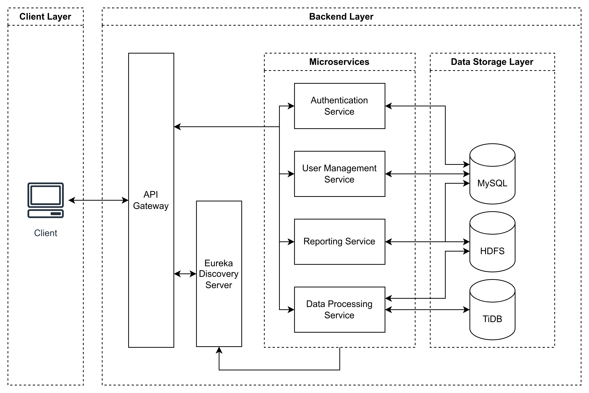

# Reporting Tool

A reporting tool that provides comprehensive reporting capabilities, user management, and social media data integration. This service is built using Spring Boot and follows a layered architecture pattern.

## Architecture



## Prerequisites

- Java 17 or higher
- MySQL 8.0 or higher
- Maven 3.8 or higher
- Docker and Docker Compose

## Setup

### 1. Clone the repository

```bash
git clone https://github.com/haiphamcoder/reporting-tool.git
cd reporting-tool
```

### 2. Initialize Required Directories

```bash
make init
```

### 3. Build and Start Services

#### Option 1: Using Docker Compose (Recommended)

```bash
# Start all services
docker compose up
```

#### Option 2: Manual Setup

1. **Start MySQL Database**

```bash
docker compose up -d mysql-server
```

2. **Start Eureka Discovery Server**

```bash
cd eureka-discovery-server
mvn clean install
mvn spring-boot:run
```

3. **Start API Gateway**

```bash
cd api-gateway
mvn clean install
mvn spring-boot:run
```

4. **Start Other Services**

```bash
# Start Authentication Service
cd authentication-service
mvn clean install
mvn spring-boot:run

# Start User Management Service
cd user-management-service
mvn clean install
mvn spring-boot:run

# Start Reporting Service
cd reporting-service
mvn clean install
mvn spring-boot:run

# Start Data Processing Service
cd data-processing-service
mvn clean install
mvn spring-boot:run

# Start Integrated Service
cd integrated-service
mvn clean install
mvn spring-boot:run
```

### 5. Frontend Setup

```bash
cd frontend
npm install
npm run dev
```

## API Documentation

The API documentation is available at `http://localhost:8765/swagger-ui.html` when the application is running.

## Security

- JWT-based authentication with configurable token expiration
- Password encryption using BCrypt
- CSRF protection

## Development

### Project Structure

```text
src/
├── main/
│   ├── java/
│   │   └── com/
│   │       └── cdp/
│   │           ├── config/        # Configuration classes
│   │           ├── controller/    # REST controllers
│   │           ├── model/         # Data models
│   │           ├── repository/    # JPA repositories
│   │           ├── security/      # Security configuration
│   │           ├── service/       # Business logic
│   │           └── util/          # Utility classes
│   └── resources/
│       ├── application.properties # Application configuration
│       └── application.yml        # Additional configuration
```

### Available Make Commands

```bash
make init     # Create required directories
make clean    # Clean up logs and tmp directories
make up       # Start docker containers
make down     # Stop docker containers
make restart  # Restart docker containers
make logs     # View logs of containers
make ps       # List running containers
make help     # Display help
```
