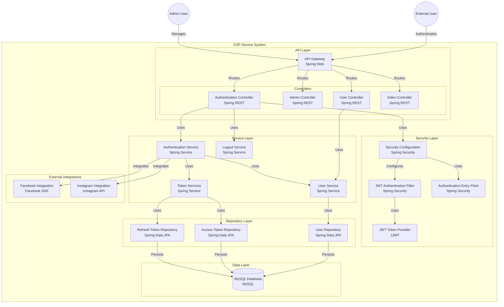

# Reporting Tool

A reporting tool that provides comprehensive reporting capabilities, user management, and social media data integration. This service is built using Spring Boot and follows a layered architecture pattern.

## Features

- **Reporting & Analytics**
  - User activity reports
  - Social media engagement metrics
  - Custom report generation
  - Data export capabilities
  - Real-time analytics dashboard

- **Authentication & Authorization**
  - JWT-based authentication
  - Role-based access control
  - Token management (access & refresh tokens)
  - Secure logout functionality

- **User Management**
  - User registration and profile management
  - Admin user management capabilities
  - Role-based permissions

- **Social Media Integration**
  - Facebook data integration for reporting
  - Instagram API integration for analytics
  - Social media data synchronization
  - Engagement metrics tracking

## Architecture



## Prerequisites

- Java 17 or higher
- MySQL 8.0 or higher
- Maven 3.8 or higher
- Docker and Docker Compose
- Facebook Developer Account (for Facebook integration)
- Instagram Business Account (for Instagram integration)
- Node.js 16+ and npm (for frontend development)

## Setup

### 1. Clone the repository

```bash
git clone https://github.com/haiphamcoder/reporting-tool.git
cd reporting-tool
```

### 2. Environment Setup

Create a `.env` file in the root directory with the following variables:

```env
# Database Configuration
MYSQL_VERSION=8.0
MYSQL_ROOT_PASSWORD=root
MYSQL_DATABASE=reporting_tool
MYSQL_USER=root
MYSQL_PASSWORD=root

# Hadoop Configuration
HADOOP_VERSION=3.3.6

# TiDB Configuration
TIDB_VERSION=v7.1.0

# Service Ports
EUREKA_PORT=8761
API_GATEWAY_PORT=8765
AUTH_SERVICE_PORT=8091
USER_SERVICE_PORT=8092
REPORTING_SERVICE_PORT=8093
DATA_PROCESSING_SERVICE_PORT=8094
INTEGRATED_SERVICE_PORT=8095
```

### 3. Initialize Required Directories

```bash
make init
```

### 4. Build and Start Services

#### Option 1: Using Docker Compose (Recommended)

```bash
# Start all services
make up

# Check service status
make ps

# View logs
make logs
```

#### Option 2: Manual Setup

1. **Start MySQL Database**

```bash
docker compose up -d mysql-server
```

2. **Start Eureka Discovery Server**

```bash
cd eureka-discovery-server
mvn clean install
mvn spring-boot:run
```

3. **Start API Gateway**

```bash
cd api-gateway
mvn clean install
mvn spring-boot:run
```

4. **Start Other Services**

```bash
# Start Authentication Service
cd authentication-service
mvn clean install
mvn spring-boot:run

# Start User Management Service
cd user-management-service
mvn clean install
mvn spring-boot:run

# Start Reporting Service
cd reporting-service
mvn clean install
mvn spring-boot:run

# Start Data Processing Service
cd data-processing-service
mvn clean install
mvn spring-boot:run

# Start Integrated Service
cd integrated-service
mvn clean install
mvn spring-boot:run
```

### 5. Frontend Setup

```bash
cd frontend
npm install
npm run dev
```

## API Documentation

The API documentation is available at `http://localhost:8765/swagger-ui.html` when the application is running.

### Key Endpoints

- **Reporting & Analytics**
  - GET `/api/reports/user-activity` - Get user activity reports
  - GET `/api/reports/social-engagement` - Get social media engagement metrics
  - POST `/api/reports/generate` - Generate custom reports
  - GET `/api/reports/export/{format}` - Export reports in specified format (CSV, PDF, Excel)
  - GET `/api/reports/dashboard` - Get real-time analytics dashboard data

- **Authentication**
  - POST `/api/auth/login` - User login
  - POST `/api/auth/register` - User registration
  - POST `/api/auth/refresh` - Refresh access token
  - POST `/api/auth/logout` - User logout

- **User Management**
  - GET `/api/users/profile` - Get user profile
  - PUT `/api/users/profile` - Update user profile
  - GET `/api/admin/users` - List all users (Admin only)
  - PUT `/api/admin/users/{id}` - Update user (Admin only)

## Security

- JWT-based authentication with configurable token expiration
- Password encryption using BCrypt
- CSRF protection
- Rate limiting on authentication endpoints
- Secure session management

## Development

### Project Structure

```text
src/
├── main/
│   ├── java/
│   │   └── com/
│   │       └── cdp/
│   │           ├── config/        # Configuration classes
│   │           ├── controller/    # REST controllers
│   │           ├── model/         # Data models
│   │           ├── repository/    # JPA repositories
│   │           ├── security/      # Security configuration
│   │           ├── service/       # Business logic
│   │           └── util/          # Utility classes
│   └── resources/
│       ├── application.properties # Application configuration
│       └── application.yml        # Additional configuration
```

### Available Make Commands

```bash
make init     # Create required directories
make clean    # Clean up logs and tmp directories
make up       # Start docker containers
make down     # Stop docker containers
make restart  # Restart docker containers
make logs     # View logs of containers
make ps       # List running containers
make help     # Display help
```
