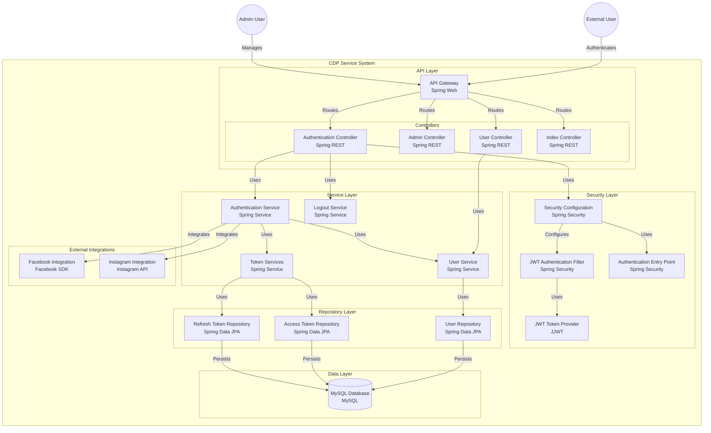

# CDP for Service

## Architecture

```mermaid
graph TB
    User((External User))
    Admin((Admin User))

    subgraph "CDP Service System"
        subgraph "API Layer"
            APIGateway["API Gateway<br>Spring Web"]
            
            subgraph "Controllers"
                AuthController["Authentication Controller<br>Spring REST"]
                AdminController["Admin Controller<br>Spring REST"]
                UserController["User Controller<br>Spring REST"]
                IndexController["Index Controller<br>Spring REST"]
            end
        end

        subgraph "Security Layer"
            SecurityConfig["Security Configuration<br>Spring Security"]
            JWTFilter["JWT Authentication Filter<br>Spring Security"]
            JWTProvider["JWT Token Provider<br>JJWT"]
            AuthEntryPoint["Authentication Entry Point<br>Spring Security"]
        end

        subgraph "Service Layer"
            AuthService["Authentication Service<br>Spring Service"]
            UserService["User Service<br>Spring Service"]
            TokenServices["Token Services<br>Spring Service"]
            LogoutService["Logout Service<br>Spring Service"]
        end

        subgraph "Repository Layer"
            UserRepo["User Repository<br>Spring Data JPA"]
            AccessTokenRepo["Access Token Repository<br>Spring Data JPA"]
            RefreshTokenRepo["Refresh Token Repository<br>Spring Data JPA"]
        end

        subgraph "Data Layer"
            Database[("MySQL Database<br>MySQL")]
        end

        subgraph "External Integrations"
            FacebookAPI["Facebook Integration<br>Facebook SDK"]
            InstagramAPI["Instagram Integration<br>Instagram API"]
        end
    end

    %% User interactions
    User -->|"Authenticates"| APIGateway
    Admin -->|"Manages"| APIGateway

    %% API Gateway connections
    APIGateway -->|"Routes"| AuthController
    APIGateway -->|"Routes"| AdminController
    APIGateway -->|"Routes"| UserController
    APIGateway -->|"Routes"| IndexController

    %% Security flow
    AuthController -->|"Uses"| SecurityConfig
    SecurityConfig -->|"Configures"| JWTFilter
    JWTFilter -->|"Uses"| JWTProvider
    SecurityConfig -->|"Uses"| AuthEntryPoint

    %% Service layer connections
    AuthController -->|"Uses"| AuthService
    UserController -->|"Uses"| UserService
    AuthService -->|"Uses"| TokenServices
    AuthService -->|"Uses"| UserService
    AuthController -->|"Uses"| LogoutService

    %% Repository connections
    UserService -->|"Uses"| UserRepo
    TokenServices -->|"Uses"| AccessTokenRepo
    TokenServices -->|"Uses"| RefreshTokenRepo

    %% Database connections
    UserRepo -->|"Persists"| Database
    AccessTokenRepo -->|"Persists"| Database
    RefreshTokenRepo -->|"Persists"| Database

    %% External integrations
    AuthService -->|"Integrates"| FacebookAPI
    AuthService -->|"Integrates"| InstagramAPI
```
