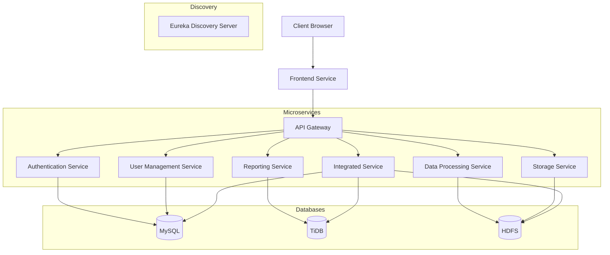
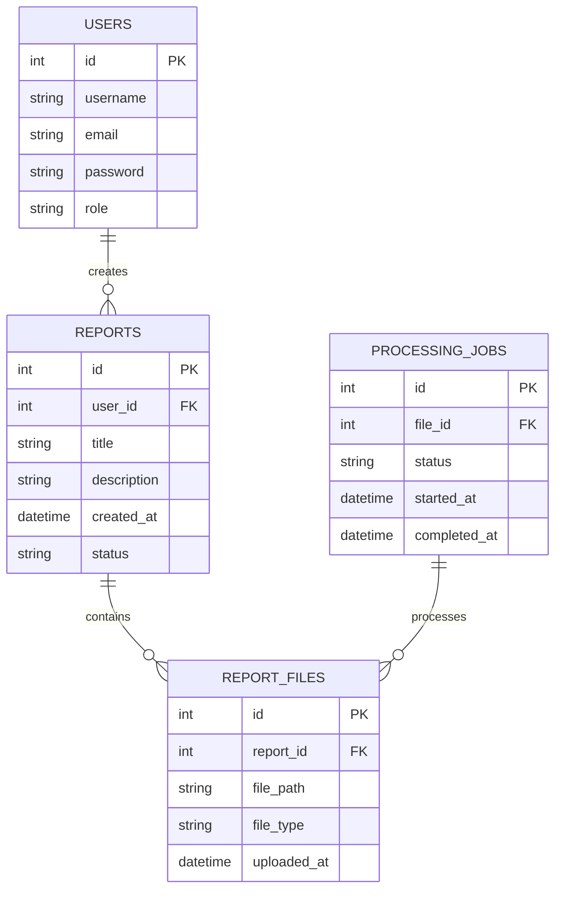
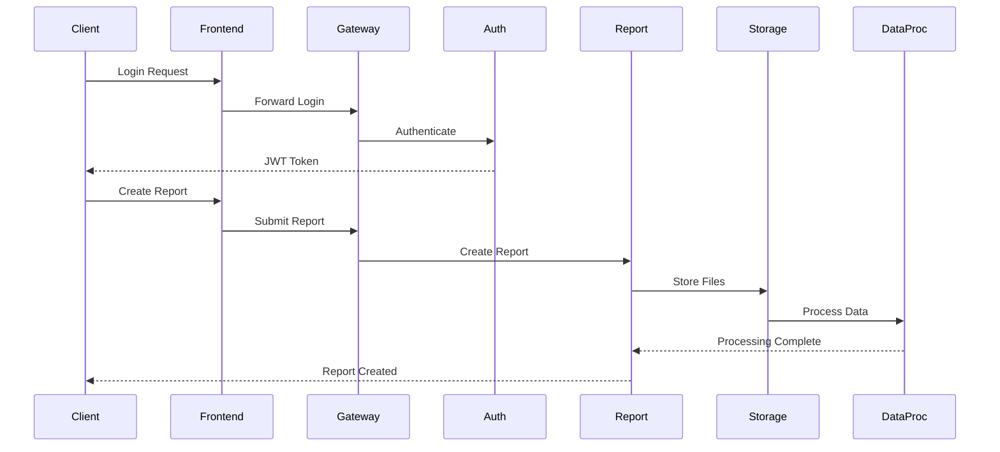
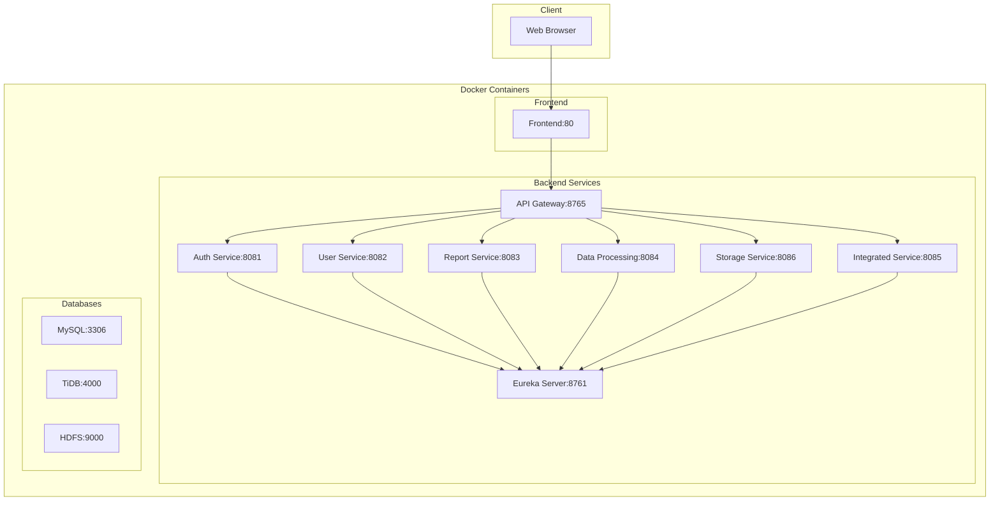

# Diagram

```mermaid
graph TB
    Client[Client Browser] --> Frontend[Frontend Service]
    Frontend --> APIGateway[API Gateway]
    
    subgraph Microservices
        APIGateway --> Auth[Authentication Service]
        APIGateway --> User[User Management Service]
        APIGateway --> Report[Reporting Service]
        APIGateway --> DataProc[Data Processing Service]
        APIGateway --> Storage[Storage Service]
        APIGateway --> Integrated[Integrated Service]
    end
    
    subgraph Discovery
        Eureka[Eureka Discovery Server]
    end
    
    subgraph Databases
        MySQL[(MySQL)]
        TiDB[(TiDB)]
        HDFS[(HDFS)]
    end
    
    Auth --> MySQL
    User --> MySQL
    Report --> TiDB
    DataProc --> HDFS
    Storage --> HDFS
    Integrated --> MySQL
    Integrated --> TiDB
    Integrated --> HDFS
```

```mermaid
erDiagram
    USERS ||--o{ REPORTS : creates
    USERS {
        int id PK
        string username
        string email
        string password
        string role
    }
    
    REPORTS ||--o{ REPORT_FILES : contains
    REPORTS {
        int id PK
        int user_id FK
        string title
        string description
        datetime created_at
        string status
    }
    
    REPORT_FILES {
        int id PK
        int report_id FK
        string file_path
        string file_type
        datetime uploaded_at
    }
    
    PROCESSING_JOBS ||--o{ REPORT_FILES : processes
    PROCESSING_JOBS {
        int id PK
        int file_id FK
        string status
        datetime started_at
        datetime completed_at
    }
```

```mermaid
sequenceDiagram
    participant Client
    participant Frontend
    participant Gateway
    participant Auth
    participant Report
    participant Storage
    participant DataProc
    
    Client->>Frontend: Login Request
    Frontend->>Gateway: Forward Login
    Gateway->>Auth: Authenticate
    Auth-->>Client: JWT Token
    
    Client->>Frontend: Create Report
    Frontend->>Gateway: Submit Report
    Gateway->>Report: Create Report
    Report->>Storage: Store Files
    Storage->>DataProc: Process Data
    DataProc-->>Report: Processing Complete
    Report-->>Client: Report Created
```

```mermaid
graph TB
    subgraph Client
        Browser[Web Browser]
    end
    
    subgraph Docker Containers
        subgraph Frontend
            FrontendContainer[Frontend:80]
        end
        
        subgraph Backend Services
            GatewayContainer[API Gateway:8765]
            AuthContainer[Auth Service:8081]
            UserContainer[User Service:8082]
            ReportContainer[Report Service:8083]
            DataProcContainer[Data Processing:8084]
            StorageContainer[Storage Service:8086]
            IntegratedContainer[Integrated Service:8085]
            EurekaContainer[Eureka Server:8761]
        end
        
        subgraph Databases
            MySQLContainer[MySQL:3306]
            TiDBContainer[TiDB:4000]
            HDFSContainer[HDFS:9000]
        end
    end
    
    Browser --> FrontendContainer
    FrontendContainer --> GatewayContainer
    GatewayContainer --> AuthContainer
    GatewayContainer --> UserContainer
    GatewayContainer --> ReportContainer
    GatewayContainer --> DataProcContainer
    GatewayContainer --> StorageContainer
    GatewayContainer --> IntegratedContainer
    
    AuthContainer --> EurekaContainer
    UserContainer --> EurekaContainer
    ReportContainer --> EurekaContainer
    DataProcContainer --> EurekaContainer
    StorageContainer --> EurekaContainer
    IntegratedContainer --> EurekaContainer
```
