# Diagram

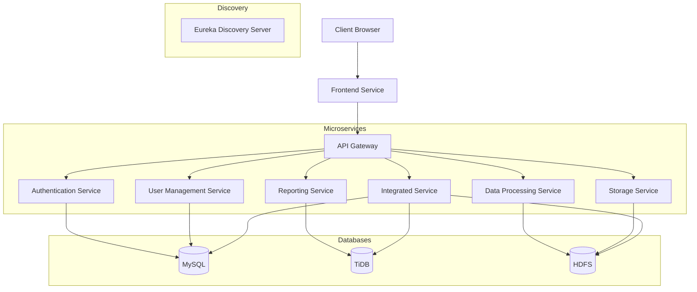
```mermaid
graph TB
    Client[Client Browser] --> Frontend[Frontend Service]
    Frontend --> APIGateway[API Gateway]
    
    subgraph Microservices
        APIGateway --> Auth[Authentication Service]
        APIGateway --> User[User Management Service]
        APIGateway --> Report[Reporting Service]
        APIGateway --> DataProc[Data Processing Service]
        APIGateway --> Storage[Storage Service]
        APIGateway --> Integrated[Integrated Service]
    end
    
    subgraph Discovery
        Eureka[Eureka Discovery Server]
    end
    
    subgraph Databases
        MySQL[(MySQL)]
        TiDB[(TiDB)]
        HDFS[(HDFS)]
    end
    
    Auth --> MySQL
    User --> MySQL
    Report --> TiDB
    DataProc --> HDFS
    Storage --> HDFS
    Integrated --> MySQL
    Integrated --> TiDB
    Integrated --> HDFS
```

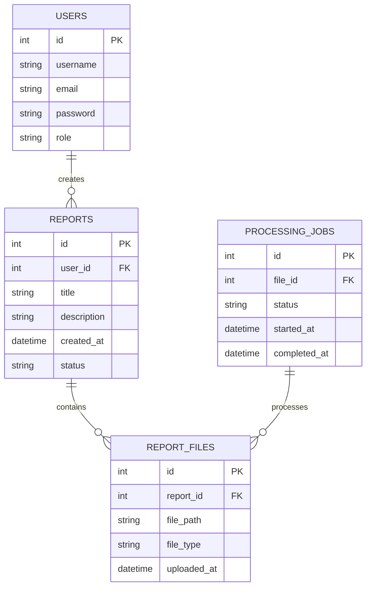
```mermaid
erDiagram
    USERS ||--o{ REPORTS : creates
    USERS {
        int id PK
        string username
        string email
        string password
        string role
    }
    
    REPORTS ||--o{ REPORT_FILES : contains
    REPORTS {
        int id PK
        int user_id FK
        string title
        string description
        datetime created_at
        string status
    }
    
    REPORT_FILES {
        int id PK
        int report_id FK
        string file_path
        string file_type
        datetime uploaded_at
    }
    
    PROCESSING_JOBS ||--o{ REPORT_FILES : processes
    PROCESSING_JOBS {
        int id PK
        int file_id FK
        string status
        datetime started_at
        datetime completed_at
    }
```

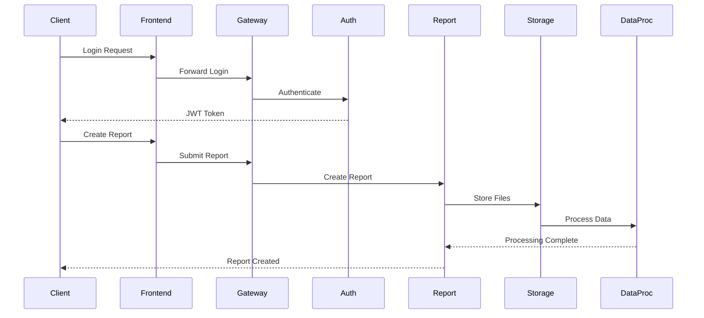
```mermaid
sequenceDiagram
    participant Client
    participant Frontend
    participant Gateway
    participant Auth
    participant Report
    participant Storage
    participant DataProc
    
    Client->>Frontend: Login Request
    Frontend->>Gateway: Forward Login
    Gateway->>Auth: Authenticate
    Auth-->>Client: JWT Token
    
    Client->>Frontend: Create Report
    Frontend->>Gateway: Submit Report
    Gateway->>Report: Create Report
    Report->>Storage: Store Files
    Storage->>DataProc: Process Data
    DataProc-->>Report: Processing Complete
    Report-->>Client: Report Created
```

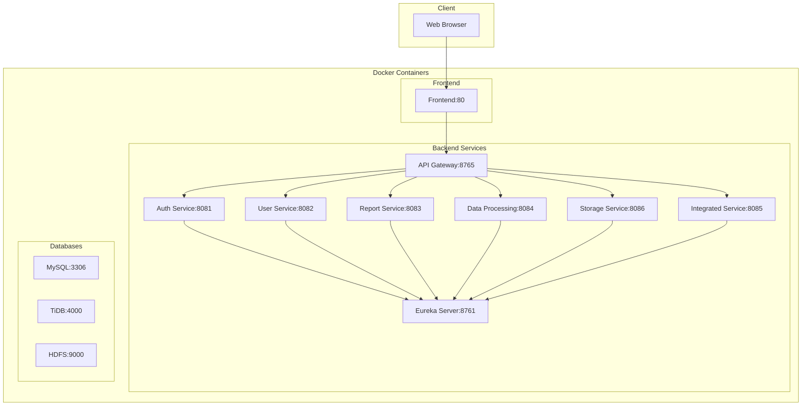
```mermaid
graph TB
    subgraph Client
        Browser[Web Browser]
    end
    
    subgraph Docker Containers
        subgraph Frontend
            FrontendContainer[Frontend:80]
        end
        
        subgraph Backend Services
            GatewayContainer[API Gateway:8765]
            AuthContainer[Auth Service:8081]
            UserContainer[User Service:8082]
            ReportContainer[Report Service:8083]
            DataProcContainer[Data Processing:8084]
            StorageContainer[Storage Service:8086]
            IntegratedContainer[Integrated Service:8085]
            EurekaContainer[Eureka Server:8761]
        end
        
        subgraph Databases
            MySQLContainer[MySQL:3306]
            TiDBContainer[TiDB:4000]
            HDFSContainer[HDFS:9000]
        end
    end
    
    Browser --> FrontendContainer
    FrontendContainer --> GatewayContainer
    GatewayContainer --> AuthContainer
    GatewayContainer --> UserContainer
    GatewayContainer --> ReportContainer
    GatewayContainer --> DataProcContainer
    GatewayContainer --> StorageContainer
    GatewayContainer --> IntegratedContainer
    
    AuthContainer --> EurekaContainer
    UserContainer --> EurekaContainer
    ReportContainer --> EurekaContainer
    DataProcContainer --> EurekaContainer
    StorageContainer --> EurekaContainer
    IntegratedContainer --> EurekaContainer
```

## Comprehensive System Design Diagram

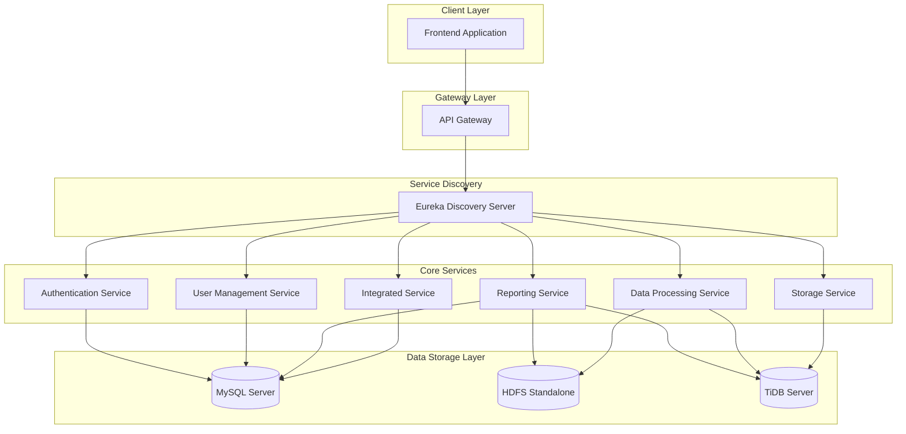
```mermaid
graph TB
    subgraph Client Layer
        FE[Frontend Application]
    end

    subgraph Gateway Layer
        API[API Gateway]
    end

    subgraph Service Discovery
        Eureka[Eureka Discovery Server]
    end

    subgraph Core Services
        Auth[Authentication Service]
        UserMgmt[User Management Service]
        Report[Reporting Service]
        DataProc[Data Processing Service]
        Storage[Storage Service]
        Integ[Integrated Service]
    end

    subgraph Data Storage Layer
        MySQL[(MySQL Server)]
        HDFS[(HDFS Standalone)]
        TiDB[(TiDB Server)]
    end

    FE --> API
    API --> Eureka
    Eureka --> Auth
    Eureka --> UserMgmt
    Eureka --> Report
    Eureka --> DataProc
    Eureka --> Storage
    Eureka --> Integ

    Auth --> MySQL
    UserMgmt --> MySQL
    Report --> MySQL
    Report --> HDFS
    Report --> TiDB
    DataProc --> HDFS
    DataProc --> TiDB
    Storage --> TiDB
    Integ --> MySQL
```

## Relationship with Discovery Clients

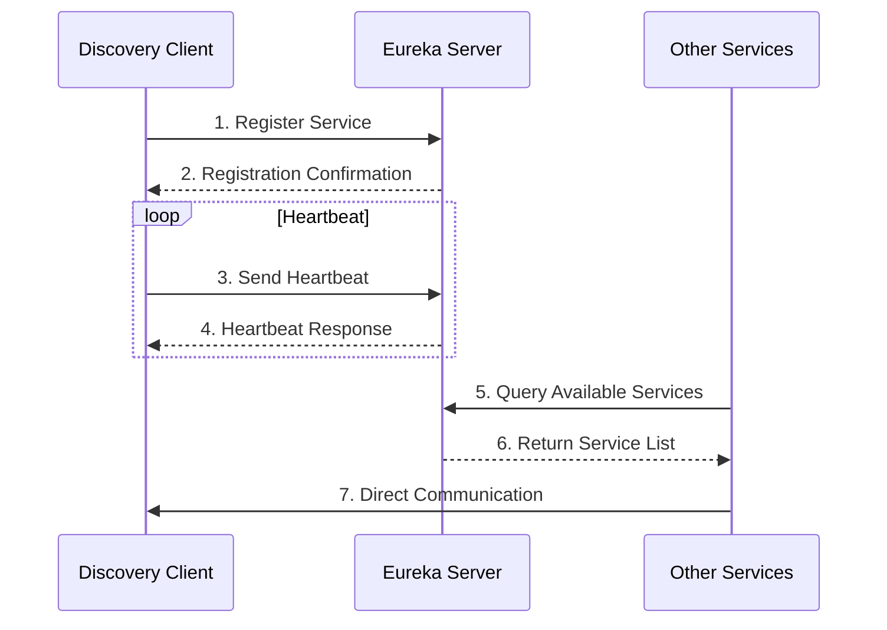
```mermaid
sequenceDiagram
    participant Client as Discovery Client
    participant Eureka as Eureka Server
    participant Other as Other Services

    Client->>Eureka: 1. Register Service
    Eureka-->>Client: 2. Registration Confirmation
    
    loop Heartbeat
        Client->>Eureka: 3. Send Heartbeat
        Eureka-->>Client: 4. Heartbeat Response
    end

    Other->>Eureka: 5. Query Available Services
    Eureka-->>Other: 6. Return Service List
    Other->>Client: 7. Direct Communication
```

## Database design diagram

```mermaid
erDiagram
    %% MySQL Database Schema
    User {
        bigint id PK
        string username
        string email
        string password
        string full_name
        string role
        boolean is_active
        datetime created_at
        datetime updated_at
    }

    RefreshToken {
        bigint id PK
        bigint user_id FK
        string token
        datetime expiry_date
        datetime created_at
    }

    SourceConnector {
        bigint id PK
        bigint user_id FK
        string name
        string type
        string connection_string
        string credentials
        boolean is_active
        datetime created_at
        datetime updated_at
    }

    Chart {
        bigint id PK
        bigint user_id FK
        bigint source_id FK
        string name
        string type
        string query
        json configuration
        datetime created_at
        datetime updated_at
    }

    Report {
        bigint id PK
        bigint user_id FK
        string name
        string description
        boolean is_public
        datetime created_at
        datetime updated_at
    }

    ReportChart {
        bigint report_id FK
        bigint chart_id FK
        int position
    }

    %% TiDB Database Schema
    SourceData {
        bigint id PK
        bigint source_id FK
        string table_name
        json schema
        datetime last_updated
    }

    ProcessedData {
        bigint id PK
        bigint source_id FK
        string data_type
        json data
        datetime processed_at
    }

    %% Relationships
    User ||--o{ RefreshToken : "has"
    User ||--o{ SourceConnector : "owns"
    User ||--o{ Chart : "creates"
    User ||--o{ Report : "creates"
    SourceConnector ||--o{ Chart : "used_by"
    Chart }o--o{ Report : "belongs_to"
    SourceConnector ||--o{ SourceData : "generates"
    SourceConnector ||--o{ ProcessedData : "processes"

    %% HDFS Structure
    subgraph HDFS
        RawData["/raw_data"]
        FileStorage["/file_storage"]
    end
```

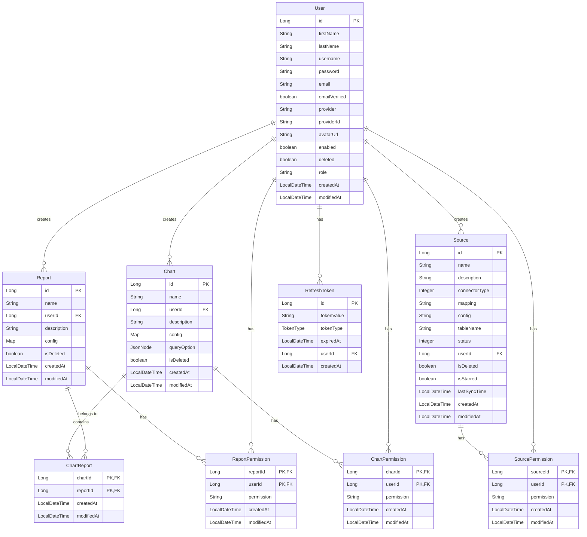
```mermaid
erDiagram
    User {
        Long id PK
        String firstName
        String lastName
        String username
        String password
        String email
        boolean emailVerified
        String provider
        String providerId
        String avatarUrl
        boolean enabled
        boolean deleted
        String role
        LocalDateTime createdAt
        LocalDateTime modifiedAt
    }

    Report {
        Long id PK
        String name
        Long userId FK
        String description
        Map config
        boolean isDeleted
        LocalDateTime createdAt
        LocalDateTime modifiedAt
    }

    Chart {
        Long id PK
        String name
        Long userId FK
        String description
        Map config
        JsonNode queryOption
        boolean isDeleted
        LocalDateTime createdAt
        LocalDateTime modifiedAt
    }

    Source {
        Long id PK
        String name
        String description
        Integer connectorType
        String mapping
        String config
        String tableName
        Integer status
        Long userId FK
        boolean isDeleted
        boolean isStarred
        LocalDateTime lastSyncTime
        LocalDateTime createdAt
        LocalDateTime modifiedAt
    }

    ChartReport {
        Long chartId PK,FK
        Long reportId PK,FK
        LocalDateTime createdAt
        LocalDateTime modifiedAt
    }

    ChartPermission {
        Long chartId PK,FK
        Long userId PK,FK
        String permission
        LocalDateTime createdAt
        LocalDateTime modifiedAt
    }

    ReportPermission {
        Long reportId PK,FK
        Long userId PK,FK
        String permission
        LocalDateTime createdAt
        LocalDateTime modifiedAt
    }

    SourcePermission {
        Long sourceId PK,FK
        Long userId PK,FK
        String permission
        LocalDateTime createdAt
        LocalDateTime modifiedAt
    }

    RefreshToken {
        Long id PK
        String tokenValue
        TokenType tokenType
        LocalDateTime expiredAt
        Long userId FK
        LocalDateTime createdAt
    }

    User ||--o{ Report : "creates"
    User ||--o{ Chart : "creates"
    User ||--o{ Source : "creates"
    User ||--o{ RefreshToken : "has"
    
    Report ||--o{ ChartReport : "contains"
    Chart ||--o{ ChartReport : "belongs to"
    
    User ||--o{ ChartPermission : "has"
    Chart ||--o{ ChartPermission : "has"
    
    User ||--o{ ReportPermission : "has"
    Report ||--o{ ReportPermission : "has"
    
    User ||--o{ SourcePermission : "has"
    Source ||--o{ SourcePermission : "has"
```

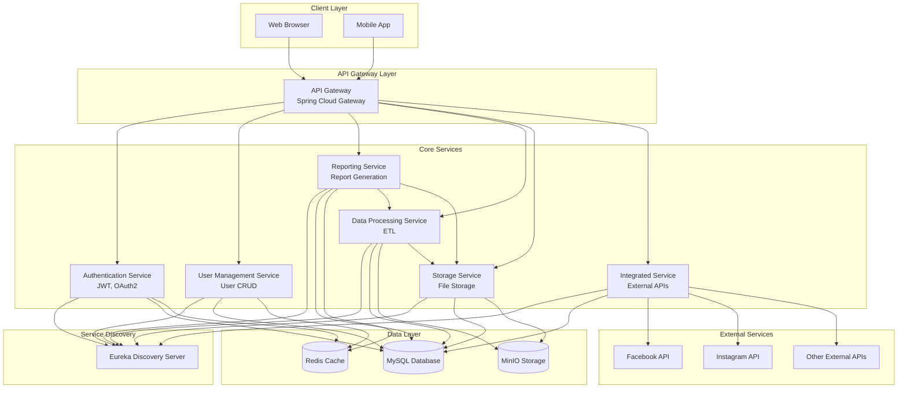
```mermaid
graph TB
    subgraph "Client Layer"
        Web[Web Browser]
        Mobile[Mobile App]
    end

    subgraph "API Gateway Layer"
        APIGateway[API Gateway<br>Spring Cloud Gateway]
    end

    subgraph "Service Discovery"
        Eureka[Eureka Discovery Server]
    end

    subgraph "Core Services"
        Auth[Authentication Service<br>JWT, OAuth2]
        UserMgmt[User Management Service<br>User CRUD]
        Reporting[Reporting Service<br>Report Generation]
        DataProc[Data Processing Service<br>ETL]
        Storage[Storage Service<br>File Storage]
        Integrated[Integrated Service<br>External APIs]
    end

    subgraph "Data Layer"
        MySQL[(MySQL Database)]
        Redis[(Redis Cache)]
        MinIO[(MinIO Storage)]
    end

    subgraph "External Services"
        Facebook[Facebook API]
        Instagram[Instagram API]
        Other[Other External APIs]
    end

    %% Client to API Gateway
    Web --> APIGateway
    Mobile --> APIGateway

    %% API Gateway to Services
    APIGateway --> Auth
    APIGateway --> UserMgmt
    APIGateway --> Reporting
    APIGateway --> DataProc
    APIGateway --> Storage
    APIGateway --> Integrated

    %% Service Discovery
    Auth --> Eureka
    UserMgmt --> Eureka
    Reporting --> Eureka
    DataProc --> Eureka
    Storage --> Eureka
    Integrated --> Eureka

    %% Service to Database
    Auth --> MySQL
    UserMgmt --> MySQL
    Reporting --> MySQL
    DataProc --> MySQL
    Storage --> MySQL
    Integrated --> MySQL

    %% Cache Layer
    Auth --> Redis
    UserMgmt --> Redis
    Reporting --> Redis

    %% Storage Layer
    Storage --> MinIO
    DataProc --> MinIO

    %% External Integrations
    Integrated --> Facebook
    Integrated --> Instagram
    Integrated --> Other

    %% Service Dependencies
    Reporting --> DataProc
    Reporting --> Storage
    DataProc --> Storage
```

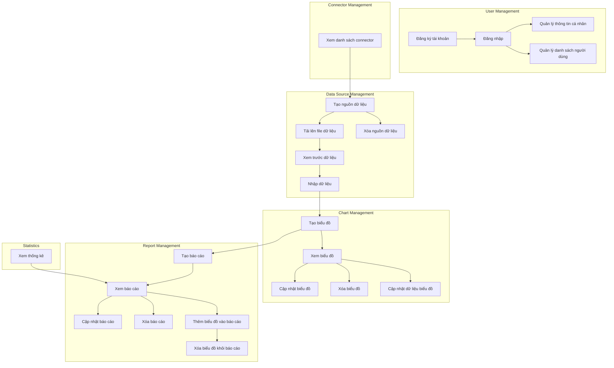
```mermaid
graph TB
    subgraph "User Management"
        Register[Đăng ký tài khoản]
        Login[Đăng nhập]
        Profile[Quản lý thông tin cá nhân]
        UserList[Quản lý danh sách người dùng]
    end

    subgraph "Data Source Management"
        CreateSource[Tạo nguồn dữ liệu]
        UploadFile[Tải lên file dữ liệu]
        PreviewData[Xem trước dữ liệu]
        ImportData[Nhập dữ liệu]
        DeleteSource[Xóa nguồn dữ liệu]
    end

    subgraph "Chart Management"
        CreateChart[Tạo biểu đồ]
        ViewChart[Xem biểu đồ]
        UpdateChart[Cập nhật biểu đồ]
        DeleteChart[Xóa biểu đồ]
        RefreshChart[Cập nhật dữ liệu biểu đồ]
    end

    subgraph "Report Management"
        CreateReport[Tạo báo cáo]
        ViewReport[Xem báo cáo]
        UpdateReport[Cập nhật báo cáo]
        DeleteReport[Xóa báo cáo]
        AddChartToReport[Thêm biểu đồ vào báo cáo]
        RemoveChartFromReport[Xóa biểu đồ khỏi báo cáo]
    end

    subgraph "Statistics"
        ViewStatistics[Xem thống kê]
    end

    subgraph "Connector Management"
        ViewConnectors[Xem danh sách connector]
    end

    %% User Management Relationships
    Register --> Login
    Login --> Profile
    Login --> UserList

    %% Data Source Management Relationships
    CreateSource --> UploadFile
    UploadFile --> PreviewData
    PreviewData --> ImportData
    CreateSource --> DeleteSource

    %% Chart Management Relationships
    CreateChart --> ViewChart
    ViewChart --> UpdateChart
    ViewChart --> DeleteChart
    ViewChart --> RefreshChart

    %% Report Management Relationships
    CreateReport --> ViewReport
    ViewReport --> UpdateReport
    ViewReport --> DeleteReport
    ViewReport --> AddChartToReport
    AddChartToReport --> RemoveChartFromReport

    %% Cross-functional Relationships
    ImportData --> CreateChart
    CreateChart --> CreateReport
    ViewStatistics --> ViewReport
    ViewConnectors --> CreateSource
```

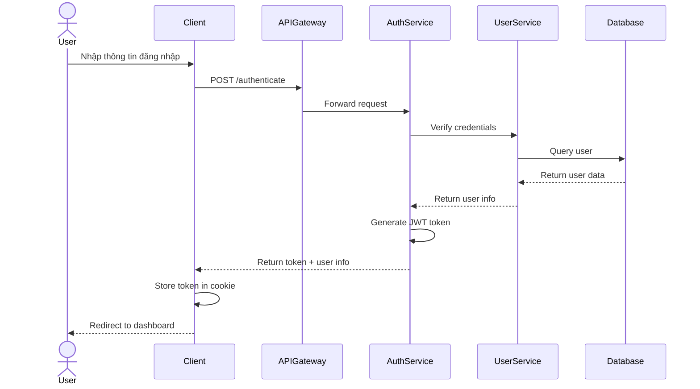
```mermaid
sequenceDiagram
    actor User
    participant Client
    participant APIGateway
    participant AuthService
    participant UserService
    participant Database

    User->>Client: Nhập thông tin đăng nhập
    Client->>APIGateway: POST /authenticate
    APIGateway->>AuthService: Forward request
    AuthService->>UserService: Verify credentials
    UserService->>Database: Query user
    Database-->>UserService: Return user data
    UserService-->>AuthService: Return user info
    AuthService->>AuthService: Generate JWT token
    AuthService-->>Client: Return token + user info
    Client->>Client: Store token in cookie
    Client-->>User: Redirect to dashboard
```

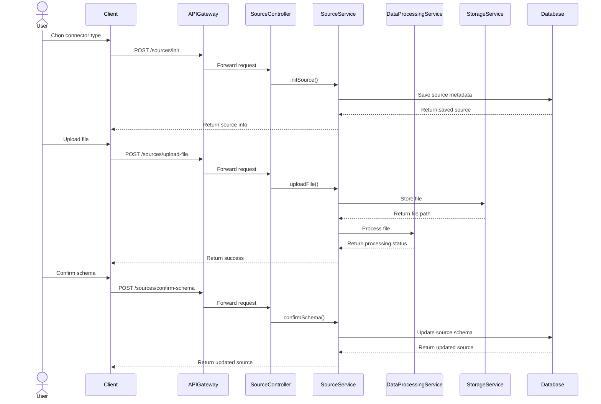
```mermaid
sequenceDiagram
    actor User
    participant Client
    participant APIGateway
    participant SourceController
    participant SourceService
    participant DataProcessingService
    participant StorageService
    participant Database

    User->>Client: Chọn connector type
    Client->>APIGateway: POST /sources/init
    APIGateway->>SourceController: Forward request
    SourceController->>SourceService: initSource()
    SourceService->>Database: Save source metadata
    Database-->>SourceService: Return saved source
    SourceService-->>Client: Return source info

    User->>Client: Upload file
    Client->>APIGateway: POST /sources/upload-file
    APIGateway->>SourceController: Forward request
    SourceController->>SourceService: uploadFile()
    SourceService->>StorageService: Store file
    StorageService-->>SourceService: Return file path
    SourceService->>DataProcessingService: Process file
    DataProcessingService-->>SourceService: Return processing status
    SourceService-->>Client: Return success

    User->>Client: Confirm schema
    Client->>APIGateway: POST /sources/confirm-schema
    APIGateway->>SourceController: Forward request
    SourceController->>SourceService: confirmSchema()
    SourceService->>Database: Update source schema
    Database-->>SourceService: Return updated source
    SourceService-->>Client: Return updated source
```

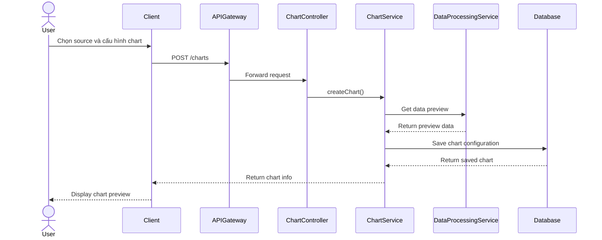
```mermaid
sequenceDiagram
    actor User
    participant Client
    participant APIGateway
    participant ChartController
    participant ChartService
    participant DataProcessingService
    participant Database

    User->>Client: Chọn source và cấu hình chart
    Client->>APIGateway: POST /charts
    APIGateway->>ChartController: Forward request
    ChartController->>ChartService: createChart()
    ChartService->>DataProcessingService: Get data preview
    DataProcessingService-->>ChartService: Return preview data
    ChartService->>Database: Save chart configuration
    Database-->>ChartService: Return saved chart
    ChartService-->>Client: Return chart info
    Client-->>User: Display chart preview
```

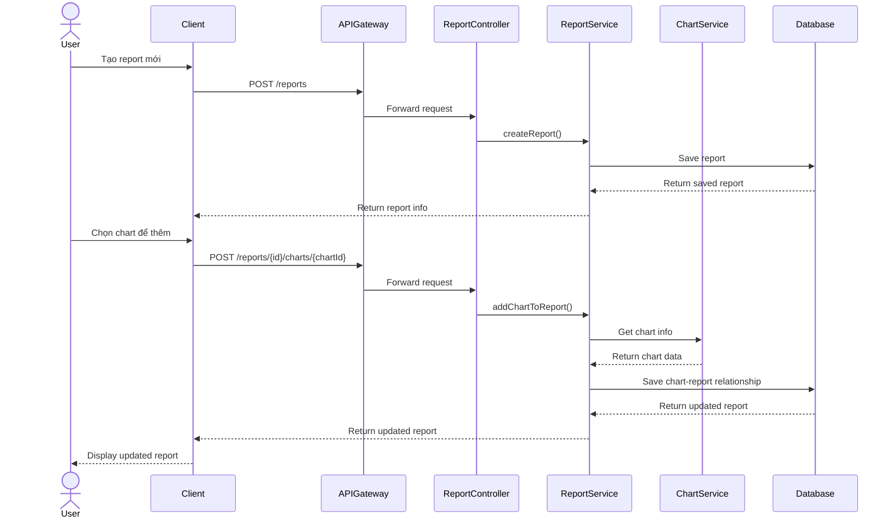
```mermaid
sequenceDiagram
    actor User
    participant Client
    participant APIGateway
    participant ReportController
    participant ReportService
    participant ChartService
    participant Database

    User->>Client: Tạo report mới
    Client->>APIGateway: POST /reports
    APIGateway->>ReportController: Forward request
    ReportController->>ReportService: createReport()
    ReportService->>Database: Save report
    Database-->>ReportService: Return saved report
    ReportService-->>Client: Return report info

    User->>Client: Chọn chart để thêm
    Client->>APIGateway: POST /reports/{id}/charts/{chartId}
    APIGateway->>ReportController: Forward request
    ReportController->>ReportService: addChartToReport()
    ReportService->>ChartService: Get chart info
    ChartService-->>ReportService: Return chart data
    ReportService->>Database: Save chart-report relationship
    Database-->>ReportService: Return updated report
    ReportService-->>Client: Return updated report
    Client-->>User: Display updated report
```

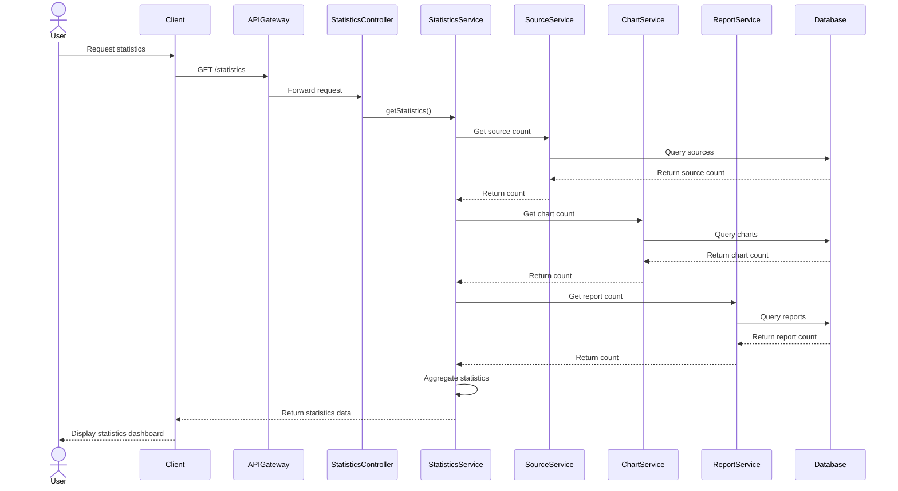
```mermaid
sequenceDiagram
    actor User
    participant Client
    participant APIGateway
    participant StatisticsController
    participant StatisticsService
    participant SourceService
    participant ChartService
    participant ReportService
    participant Database

    User->>Client: Request statistics
    Client->>APIGateway: GET /statistics
    APIGateway->>StatisticsController: Forward request
    StatisticsController->>StatisticsService: getStatistics()
    
    StatisticsService->>SourceService: Get source count
    SourceService->>Database: Query sources
    Database-->>SourceService: Return source count
    SourceService-->>StatisticsService: Return count

    StatisticsService->>ChartService: Get chart count
    ChartService->>Database: Query charts
    Database-->>ChartService: Return chart count
    ChartService-->>StatisticsService: Return count

    StatisticsService->>ReportService: Get report count
    ReportService->>Database: Query reports
    Database-->>ReportService: Return report count
    ReportService-->>StatisticsService: Return count

    StatisticsService->>StatisticsService: Aggregate statistics
    StatisticsService-->>Client: Return statistics data
    Client-->>User: Display statistics dashboard
```

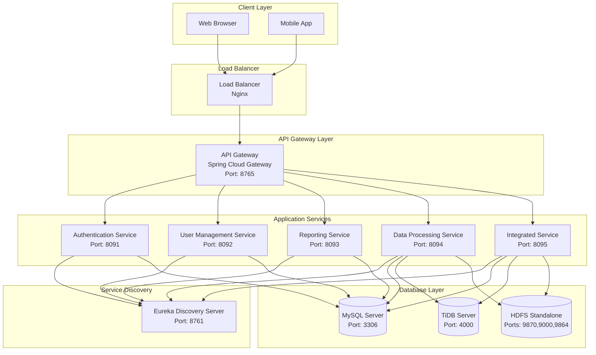
```mermaid
graph TB
    subgraph "Client Layer"
        Web[Web Browser]
        Mobile[Mobile App]
    end

    subgraph "Load Balancer"
        LB[Load Balancer<br>Nginx]
    end

    subgraph "API Gateway Layer"
        APIGateway[API Gateway<br>Spring Cloud Gateway<br>Port: 8765]
    end

    subgraph "Service Discovery"
        Eureka[Eureka Discovery Server<br>Port: 8761]
    end

    subgraph "Application Services"
        Auth[Authentication Service<br>Port: 8091]
        UserMgmt[User Management Service<br>Port: 8092]
        Reporting[Reporting Service<br>Port: 8093]
        DataProc[Data Processing Service<br>Port: 8094]
        Integrated[Integrated Service<br>Port: 8095]
    end

    subgraph "Database Layer"
        MySQL[(MySQL Server<br>Port: 3306)]
        TiDB[(TiDB Server<br>Port: 4000)]
        HDFS[(HDFS Standalone<br>Ports: 9870,9000,9864)]
    end

    %% Client to Load Balancer
    Web --> LB
    Mobile --> LB

    %% Load Balancer to API Gateway
    LB --> APIGateway

    %% API Gateway to Services
    APIGateway --> Auth
    APIGateway --> UserMgmt
    APIGateway --> Reporting
    APIGateway --> DataProc
    APIGateway --> Integrated

    %% Service Discovery
    Auth --> Eureka
    UserMgmt --> Eureka
    Reporting --> Eureka
    DataProc --> Eureka
    Integrated --> Eureka

    %% Service to Database
    Auth --> MySQL
    UserMgmt --> MySQL
    Reporting --> MySQL
    DataProc --> MySQL
    Integrated --> MySQL

    %% Service to TiDB
    DataProc --> TiDB
    Integrated --> TiDB

    %% Service to HDFS
    DataProc --> HDFS
    Integrated --> HDFS
```

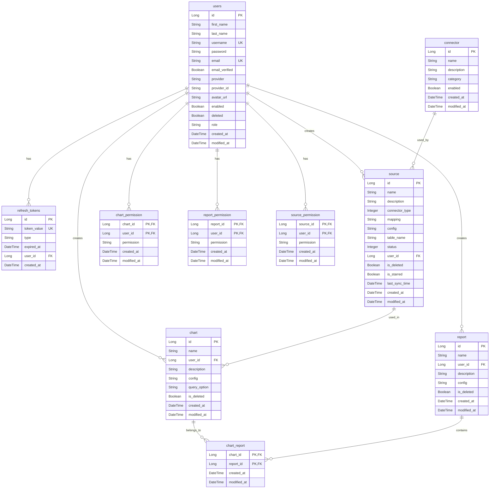
```mermaid
erDiagram
    users {
        Long id PK
        String first_name
        String last_name
        String username UK
        String password
        String email UK
        Boolean email_verified
        String provider
        String provider_id
        String avatar_url
        Boolean enabled
        Boolean deleted
        String role
        DateTime created_at
        DateTime modified_at
    }

    refresh_tokens {
        Long id PK
        String token_value UK
        String type
        DateTime expired_at
        Long user_id FK
        DateTime created_at
    }

    source {
        Long id PK
        String name
        String description
        Integer connector_type
        String mapping
        String config
        String table_name
        Integer status
        Long user_id FK
        Boolean is_deleted
        Boolean is_starred
        DateTime last_sync_time
        DateTime created_at
        DateTime modified_at
    }

    chart {
        Long id PK
        String name
        Long user_id FK
        String description
        String config
        String query_option
        Boolean is_deleted
        DateTime created_at
        DateTime modified_at
    }

    report {
        Long id PK
        String name
        Long user_id FK
        String description
        String config
        Boolean is_deleted
        DateTime created_at
        DateTime modified_at
    }

    connector {
        Long id PK
        String name
        String description
        String category
        Boolean enabled
        DateTime created_at
        DateTime modified_at
    }

    chart_permission {
        Long chart_id PK,FK
        Long user_id PK,FK
        String permission
        DateTime created_at
        DateTime modified_at
    }

    report_permission {
        Long report_id PK,FK
        Long user_id PK,FK
        String permission
        DateTime created_at
        DateTime modified_at
    }

    source_permission {
        Long source_id PK,FK
        Long user_id PK,FK
        String permission
        DateTime created_at
        DateTime modified_at
    }

    chart_report {
        Long chart_id PK,FK
        Long report_id PK,FK
        DateTime created_at
        DateTime modified_at
    }

    users ||--o{ refresh_tokens : "has"
    users ||--o{ source : "creates"
    users ||--o{ chart : "creates"
    users ||--o{ report : "creates"
    users ||--o{ chart_permission : "has"
    users ||--o{ report_permission : "has"
    users ||--o{ source_permission : "has"
    source ||--o{ chart : "used_in"
    chart ||--o{ chart_report : "belongs_to"
    report ||--o{ chart_report : "contains"
    connector ||--o{ source : "used_by"
```

1. **Flow Diagram (Activity Diagram)**:
- Tập trung vào luồng xử lý và các quyết định
- Hiển thị các bước tuần tự và các điều kiện rẽ nhánh
- Không quan tâm đến thời gian và thứ tự tương tác
- Thường được sử dụng để mô tả quy trình nghiệp vụ

2. **Sequence Diagram**:
- Tập trung vào tương tác giữa các đối tượng/component
- Hiển thị thứ tự các message được gửi và nhận
- Quan tâm đến thời gian và thứ tự tương tác
- Thường được sử dụng để mô tả chi tiết kỹ thuật

Dựa trên mã nguồn của bạn, tôi sẽ vẽ các flow diagram cho các use case chính:

1. **Flow Diagram cho Login**:
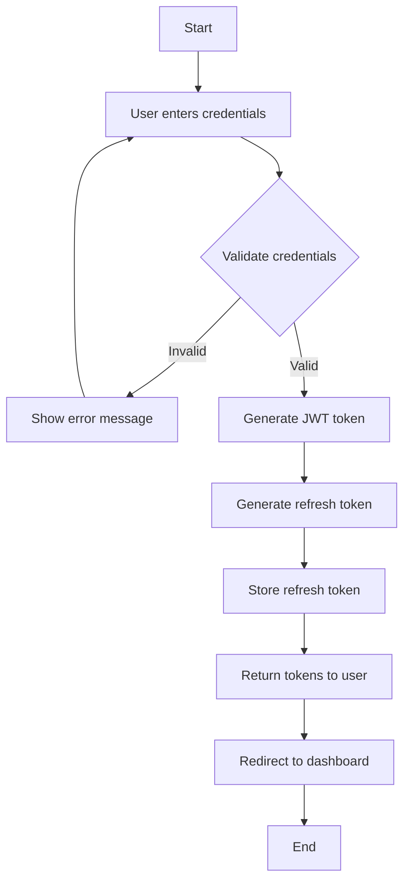
```mermaid
flowchart TD
    A[Start] --> B[User enters credentials]
    B --> C{Validate credentials}
    C -->|Invalid| D[Show error message]
    D --> B
    C -->|Valid| E[Generate JWT token]
    E --> F[Generate refresh token]
    F --> G[Store refresh token]
    G --> H[Return tokens to user]
    H --> I[Redirect to dashboard]
    I --> J[End]
```

2. **Flow Diagram cho Create Source**:
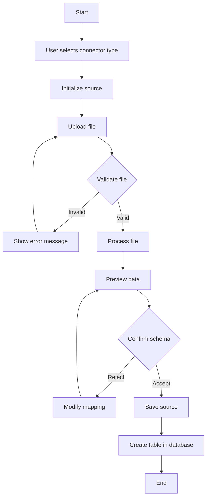
```mermaid
flowchart TD
    A[Start] --> B[User selects connector type]
    B --> C[Initialize source]
    C --> D[Upload file]
    D --> E{Validate file}
    E -->|Invalid| F[Show error message]
    F --> D
    E -->|Valid| G[Process file]
    G --> H[Preview data]
    H --> I{Confirm schema}
    I -->|Reject| J[Modify mapping]
    J --> H
    I -->|Accept| K[Save source]
    K --> L[Create table in database]
    L --> M[End]
```

3. **Flow Diagram cho Create Chart**:
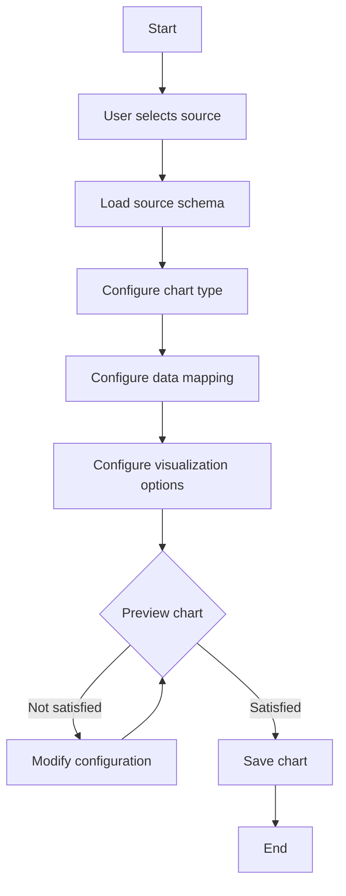
```mermaid
flowchart TD
    A[Start] --> B[User selects source]
    B --> C[Load source schema]
    C --> D[Configure chart type]
    D --> E[Configure data mapping]
    E --> F[Configure visualization options]
    F --> G{Preview chart}
    G -->|Not satisfied| H[Modify configuration]
    H --> G
    G -->|Satisfied| I[Save chart]
    I --> J[End]
```

4. **Flow Diagram cho Create Report**:
```mermaid
flowchart TD
    A[Start] --> B[User creates new report]
    B --> C[Configure report layout]
    C --> D[Select charts to add]
    D --> E{More charts?}
    E -->|Yes| D
    E -->|No| F[Configure chart positions]
    F --> G{Preview report}
    G -->|Not satisfied| H[Modify layout]
    H --> G
    G -->|Satisfied| I[Save report]
    I --> J[End]
```

5. **Flow Diagram cho View Statistics**:
```mermaid
flowchart TD
    A[Start] --> B[User requests statistics]
    B --> C[Load user permissions]
    C --> D[Query source statistics]
    D --> E[Query chart statistics]
    E --> F[Query report statistics]
    F --> G[Aggregate statistics]
    G --> H[Generate dashboard]
    H --> I[Display statistics]
    I --> J[End]
```

6. **Flow Diagram cho Data Processing**:
```mermaid
flowchart TD
    A[Start] --> B[Receive data file]
    B --> C[Validate file format]
    C -->|Invalid| D[Return error]
    C -->|Valid| E[Parse file content]
    E --> F[Transform data]
    F --> G[Validate transformed data]
    G -->|Invalid| H[Log error]
    H --> I[Return error]
    G -->|Valid| J[Store in database]
    J --> K[Update source status]
    K --> L[End]
```

7. **Flow Diagram cho Permission Management**:
```mermaid
flowchart TD
    A[Start] --> B[User requests permission change]
    B --> C{Check admin rights}
    C -->|No| D[Return unauthorized]
    C -->|Yes| E[Validate target user]
    E -->|Invalid| F[Return error]
    E -->|Valid| G[Update permission]
    G --> H[Log permission change]
    H --> I[Notify affected users]
    I --> J[End]
```

8. **Flow Diagram cho Chart Refresh**:
```mermaid
flowchart TD
    A[Start] --> B[User requests chart refresh]
    B --> C[Check chart permissions]
    C -->|No permission| D[Return unauthorized]
    C -->|Has permission| E[Load chart configuration]
    E --> F[Query source data]
    F --> G[Process data]
    G --> H[Generate new visualization]
    H --> I[Update chart cache]
    I --> J[Return updated chart]
    J --> K[End]
```

Các flow diagram này thể hiện:
1. Các bước xử lý tuần tự
2. Các điểm quyết định (decision points)
3. Các luồng xử lý lỗi
4. Các bước validation
5. Các điểm kết thúc

Mỗi flow diagram đều có:
- Điểm bắt đầu và kết thúc rõ ràng
- Các bước xử lý chính
- Các điều kiện rẽ nhánh
- Các bước xử lý lỗi
- Các bước validation