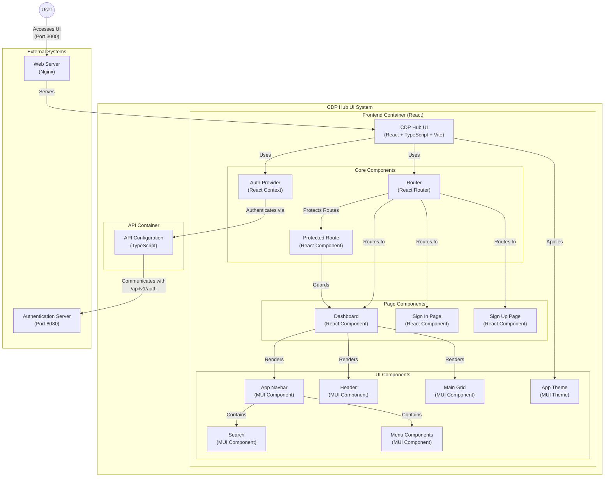

# CDP Hub UI

This is the UI for the CDP Hub. It is a React application that uses the Material-UI library.

## Features

- Modern React application built with TypeScript
- Material-UI (MUI) components and theming
- Responsive design that works on mobile and desktop
- Dark/light mode theme switching
- Authentication flows (sign in, sign up, forgot password)
- Side navigation menu with mobile support
- Profile and account management

## Architecture



## Getting Started

### Prerequisites

- Node.js 16.x or later
- npm or yarn package manager

### Installation

1. Clone the repository

```bash
git clone https://github.com/haiphamcoder/cdp-hub-ui.git
cd cdp-hub-ui
```

2. Install dependencies

```bash
npm install
```

3. Start the development server

```bash
npm run dev
```

4. Open your browser and navigate to `http://localhost:5173` to see the application in action.

## Changelog

See [CHANGELOG.md](CHANGELOG.md) for the latest changes.